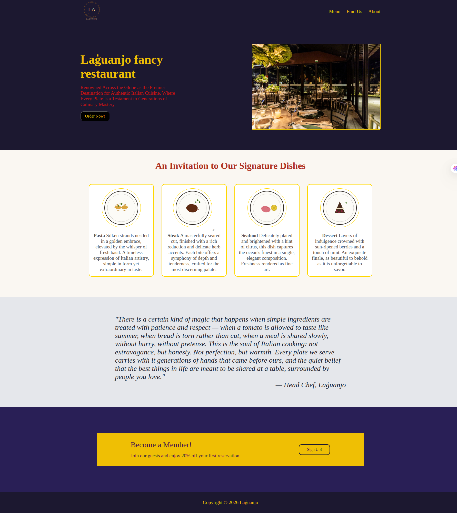

# Laguanjo
A restaurant landing page built with HTML and CSS

## Webpage preview

## The skills I'll demonstrate:
- Writing well organized easy to understand code
- Utilizing Flexbox layout for header, nav , and the main content
- Structured HTML
- Using Wrappers
- Using simple animations 

## Images Credit
hero section Image : [Matheus Bertelli | pexels](https://www.pexels.com/photo/tables-in-a-restaurant-17294775/)

## How To Run 
1. Open index.html on your browser 